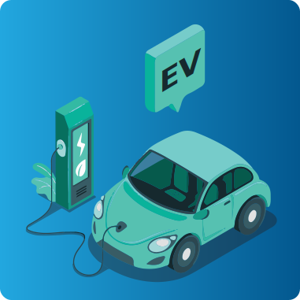

  
  
  
  
  

# Hi there 👋

  
  
  

## :hammer_and_wrench: Tech and Tools :

  </a>
  </a>
  </a>
  </a>
  </a>

 

  </a>
  </a>
  </a>
  </a>
  </a>
  </a>
  </a>

 

  </a>
  </a>
  </a>

 

  </a>
  </a>
  </a>
  <!-- </a> -->
  </a>
  </a>
  </a>

 

  </a>
  </a>
  </a>
  </a>
  </a>

 

## :zap: Domains:

  </a>
  </a>
  </a>
  </a>

 

<!-- # TO DO -> Add portfolio website -->
